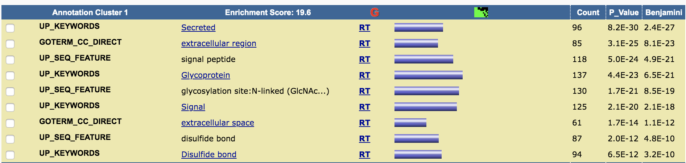

```{r setup, include=FALSE}
knitr::opts_chunk$set(echo = TRUE)
```



# Problem 3 

## 3.1 To Remember, the Brain Must Actively Forget
(https://www.quantamagazine.org/to-remember-the-brain-must-actively-forget-20180724/)

### General Topic
The article focuses on how forgetting help remember better.

### What...?
What is mushroom body neurons that dopamine releases onto?

### When...?
When would the brain start to forget things?

### Where...?
Where are the forgotten memories stored?

### How...?
+ How does protein Rac1 in the hippocampal neurons prolong the retention of memories?
+ How did researchers increase the activity of Rac1?
+ How does Rac1 involve in several forms of forgetting in fruit flies?

### Why...?
+ Why would neurogenesis complicate the challenge of retrieving prior memories from the hippocampus?
+ Why would added neural wiring damage the older engrams?
+ Why would the overlaps make it harder to isolate the old memories from newer ones?

### What if...?
What if we decrease the activity of Rac1, would it let us forget some bad things happened recently?

### I wonder if...?
I wonder if there are some special SNPs that make Rac1 different from others.

### Connection
This article reminds me of LSTM model in deep learning where we use forget gates to improve the performance.


## 3.2 Your Brain Chooses What to Let You See
(https://www.quantamagazine.org/your-brain-chooses-what-to-let-you-see-20190930/)

### General Topic
The article focuses on how attention mechanism work by filtering unimportant things.

### What...?
What are examples of automatic suppressive types of mechanisms?

### When...?
When would automatic background subtraction take place?

### Where...?
Where is the attention mechanism processed?

### How...?
+ How would we focus on important things by by lowering the priority of the rest?
+ How does brain suppress information about the movement of the background?
+ How can we perceive the movements of larger objects instead of smaller ones?

### Why...?
+ Why would older adults show little difference between perception of large and small objects?
+ Why would they get much better at recognizing that motion with longer training period?
+ Why would our brains adopt strategies that make smaller moving objects against those backgrounds stand out more?

### What if...?
What if we do some experiments on larger predators that eat larger animals, would the result be the same?

### I wonder if...?
I wonder if there are some specific neurons that make the attention strategy.

### Connection
This article reminds me of attention model in deep learning where we only focus on the most relevant information


## 3.3 The Animal Origins of Coronavirus and Flu
(https://www.quantamagazine.org/how-do-animal-viruses-like-coronavirus-jump-species-20200225/)

### General Topic

The article focuses on zoonoses, diseases that can jump between humans and other animals. In particular, it discusses the animal origins of coronavirus and influenza.

### What...?
What is the main difference between coronavirus and influenza?

### When...?
When does coronavirus result highest death rate?

### Where...?
Where are the receptors bound most by virus’s proteins?

### How...?
+ How does the virus reach the cells of the host?
+ How does the virus recognize the cells of its host?
+ How can S1 subunit of virus bind to the structure of the cells?

### Why...?
+ Why is SARS-CoV-2 more deadly than SARS-CoV and MERS-CoV?
+ Why bats and intermediate animals don't die from SARS-CoV-2?
+ Why do people get infected by intermediate animals?

### What if...?
What if we mask the cells that are bound by the virus most, could the virus still recognize them?

### I wonder if...?
I wonder if there are some properties in cells that make bats and intermediate animals immune to SARS-CoV-2?

### Connection
This article reminds me of GWAS analysis and we may use it to identify the similar virus that may be deadly to people and prepare for it.


